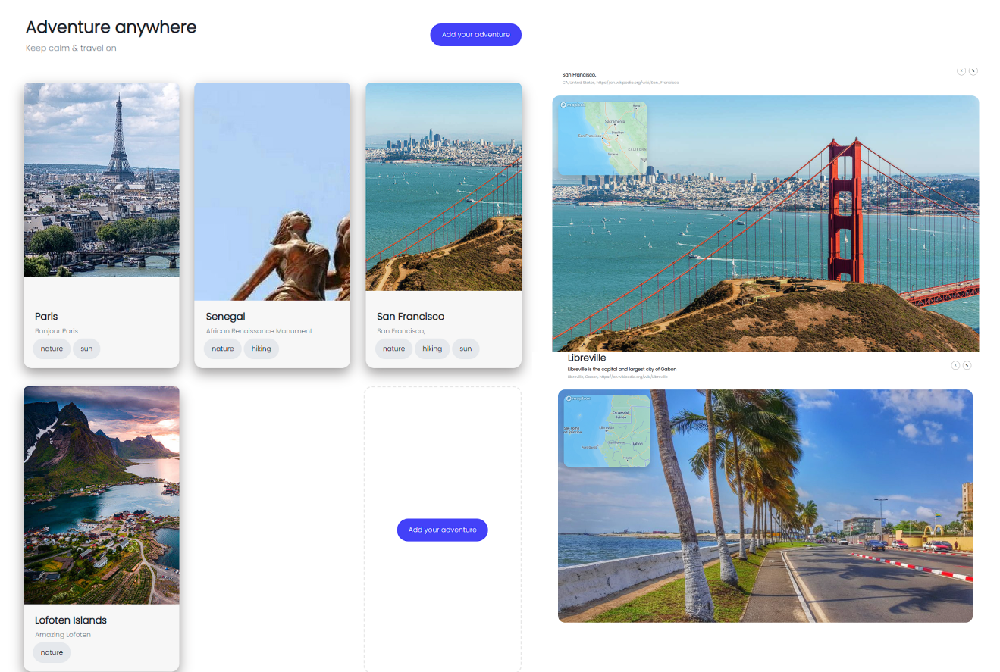

# React Travel App

React Travel App is a web-based application that allows users to create, view, edit, and delete travel posts. The app utilizes a database to store user-generated travel posts and a map API to display the location of each post.

# Features

• Allow users to create and delete their travel posts

• Display all travel posts on a map

• Display individual travel post data in a popup modal

• Edit and update posts from the UI

# Usage

To use React Travel App, simply navigate to the project's website and create a user account to start creating and viewing travel posts. Once logged in, users can view all travel posts on the map and click on individual posts to view more details.

Users can also create new posts by clicking on the "New Post" button and entering the necessary information, including the post title, description, location, and an image. Users can also edit and delete their own posts by clicking on the "Edit" or "Delete" buttons.

#Technologies
React Travel App is built using React, with the following libraries and APIs:

DataStax: for creating the database
Mapbox: for displaying maps and location information
